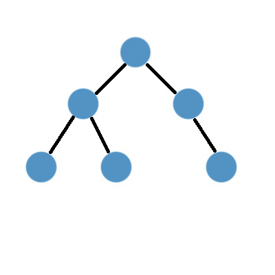

<h1 align="center">Trabalho - Thread (C012 - Sistemas Operacionais)</h1>
<h3 align="center">✅ Concluído ✅</h3>

## ❓ Sobre o projeto

Trabalho realizado para relembrar o funcionamento de **Threads**. Foi utilizado como base o código de 
**BFS** da aula de C210 (Inteligência Computacional).  
BFS (Breadth-First Search): É um algoritmo que busca o objetivo utilizando uma arvore (ou grafo). A busca na arvore é   
realizada em Largura (Amplitude).  

 

Utilizamos o algoritmos de BFS para resolver o puzzle 3x3 abaixo.  

 

Utilizamos a Thread para salvar todos os processos da fila e os nós visitados.  

**[Referencia Thread com Python](https://www.datacamp.com/community/tutorials/threading-in-python?utm_source=adwords_ppc&utm_medium=cpc&utm_campaignid=1455363063&utm_adgroupid=65083631748&utm_device=c&utm_keyword=&utm_matchtype=&utm_network=g&utm_adpostion=&utm_creative=278443377086&utm_targetid=aud-392016246653:dsa-429603003980&utm_loc_interest_ms=&utm_loc_physical_ms=1031943)**.

---

## 💻 Tecnologias

As seguintes tecnologias foram utilizadas na construção do projeto:

- **[Python](https://www.python.org/)**
 
---

## 👥 Autores

- **[Gabriel](https://github.com/Redfox0012)**
- **[Italo](https://github.com/ItaloRez)**

